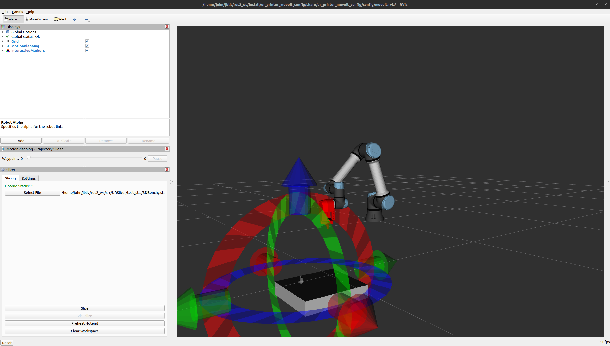
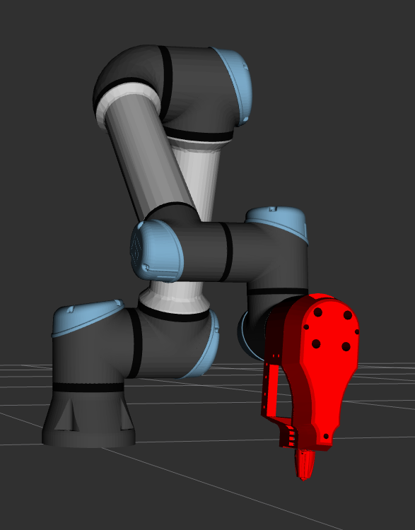
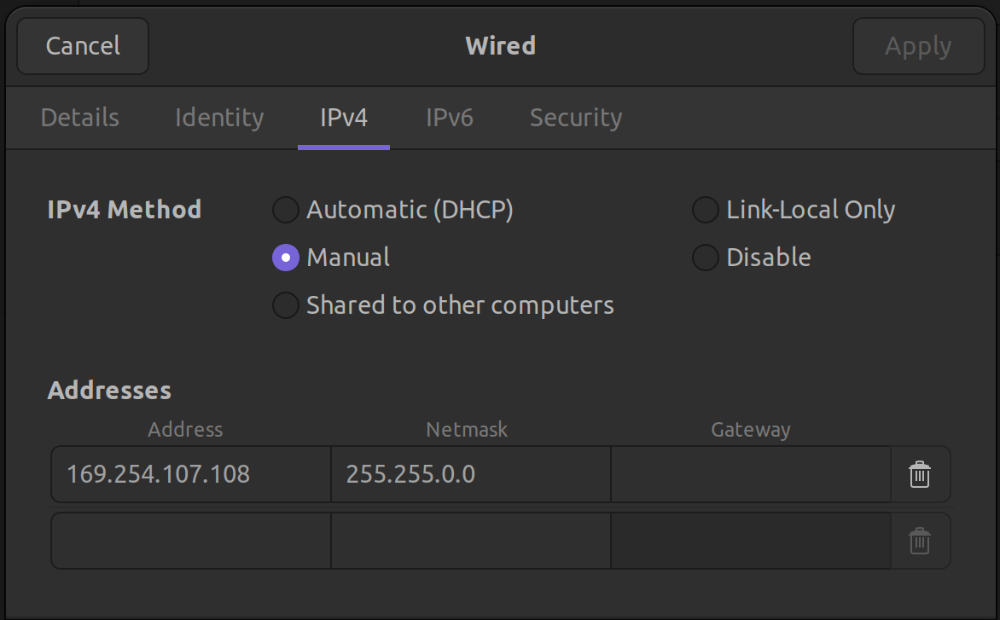

# URSlicer

This is the primary repo for the UR Slicer 3D printing project sponsored by the SiDi laboratory. This repo contains all packages and instructions for dependency installation necessary for running the slicer and printer. 

---

_**Warning:**_ Safe operation is critical to prevent injury and damage to people and objects surrounding the system. Before operating the robot, powering on the hotend, or running any prints ensure that everyone in the surrounding area is aware of the robot operation and that the robot is being monitored at all times.

---
## Table of Contents

* [Functionality Overview](#functionality-overview)
* [Key Dependencies](#key-dependencies)
* [Installation Instructions](#installation-instructions)
* [Operating Instructions](#operating-instructions)
* [Included Package Overview](#package-overview)
* [Continued Development](#continued-development)

---

## Functionality Overview

This system is intended to enable the UR5e arm and printing end effector to act as a 3D printer and enable planar printing of complex geometries. This system encompasses all aspects and steps to the 3D printing process to go from a desired STL file to a finished 3D print. While some testing has been performed it is highly possible that bugs still exist.

### Printing Process Steps

1. Open necessary terminal windows
2. Select desired print object
3. Place print object within scene and select slicing settings
4. Slice part and plan motion
5. Preheat hotend
6. Print object!

### User Interface



### Robot Model



---

## Key Dependencies

**Preface:** This project and system are heavily dependent on a linux based operating system, the command line, and ROS2. It is highly recommended to have a basic familiarity with each of these concepts. Reference material for each of these topics has been included. 

### System Requirements/Recommendations

This project was intended to be ran and used on a computer running the Ubuntu 22.04 operating system. It is possible to run this system on other operating systems or inside of a Docker container or WSL2 although this would require a higher level of familiarity with containerization and networking principles.

The installation instructions assume that a computer with a fresh Ubuntu 22.04 distribution is being used. [Here](https://www.xda-developers.com/dual-boot-windows-11-linux/) is a link to a guide for dual-booting a Windows machine with an Ubuntu distribution.


### ROS2 Humble 

[This](https://docs.ros.org/en/humble/Installation/Ubuntu-Install-Debs.html) is the link for installing the correct distribution of ROS2. It is recommended to go through both sets of beginner [tutorials](https://docs.ros.org/en/humble/Tutorials.html) if you are unfamiliar with ROS2.

### MoveIt2

The following command can be entered in the terminal to install MoveIt2. The tutorials are not necessary unless you are trying to add onto this code.

```sudo apt install ros-humble-moveit```

### UR ROS2 Drivers

The following command installs the necessary ROS2 drivers developed by Universal Robotics.

```sudo apt-get install ros-${ROS_DISTRO}-ur```

---

## Installation Instructions

### Networking Setup

In order to control the UR5e arm using another computer a few pieces of network setup are required. This only needs to be done once as long as it is not changed. These steps are not required for the simulated robot.

1. Turn on the UR5e tablet and control box

2. Ensure the network settings on the UR5e control tablet match the following image.

TODO:

3. Plug the ethernet cable from the UR5e box into your computer.

4. On the Ubuntu computer go to, **Settings -> Network -> Wired -> IPV4**

5. Apply the network settings shown in the image below.



### ROS2 Workspace Setup 

The following command will create a ROS2 workspace if you do not already have one.

```mkdir -p ~/ros2_ws/src```

Every time a new terminal is opened ensure the following line is entered unless it has been added to your bashrc.
```
source /opt/ros/humble/setup.bash
```
The following line can be entered once. This will add it to your .bashrc which is a file that runs everytime a new terminal is opened.
```
echo "source /opt/ros/humble/setup.bash" >> ~/.bashrc
```

### Package Installation

Enter the following commands to install and build the packages. (This assumes that your Github SSH Key has already been setup, tutorials for this can be found online.)

```cd ~/ros2_ws/src```

```git clone git@github.com:ronnie-stone/URSlicer.git```

```cd ~/ros2_ws```

```colcon build```

```source install/setup.bash```

---

## Operating Instructions

This project can be ran on two different setups. The first is on actual hardware for printing and hardware testing. The second is on a simulated robot arm for software testing. 

### Hardware Setup

1. Turn the UR5e arm on and plug into the ethernet cable.
2. Start the program on the pendant titled _Lyle.urp_
3. TODO: End effector setup steps

### Software instructions

1. Open 2 terminal tabs both with ROS2 sourced and enter the following in each. (If you are running a simulated robot open 3 terminals)

``` cd ~/ros2_ws```

``` source install/setup.bash```

2. **Simulated robot only:** In the first terminal run the following command.

```ros2 run ur_client_library start_ursim.sh```

3. In a terminal run the following command.

**Simulation:**  ```ros2 launch ur_printer_control start_robot.launch.py launch_rviz:=false robot_ip:=192.168.56.101```

**Real Hardware:** ```ros2 launch ur_printer_control start_robot.launch.py launch_rviz:=false robot_ip:=169.254.107.107```

4. In the final terminal run the following command.

```ros2 launch printer_manager real_slice_test.launch.py ur_type:=ur5e```

### RViz Setup

Sometimes the RViz config file will not load correctly and may need to be setup again. Below is a gif of the steps that need to be followed for doing this.

TODO: @jbliv

### Printing Instructions

1. Use the user interface in the bottom left corner to select the desired print file.

2. Place the object at the desired print location.

3. Click slice to begin printing.

4. Monitor and approve each planned motion path shown in the simulation.

---

## Package Overview

This project contains 9 primary ROS2 packages. Below is a brief summary of each one. For a detailed of each package go to the corresponding folder where each package has it's own README. TODO: @jbliv

* **[printing_manager:](printing_manager)** Component, nodes, and launch files for managing printing process
* **[slicer_node:](slicer_node)** ROS2 wrapper node for slicing scripts
* **[slicer_panel:](slicer_panel)** Custom RViz2 panel for user interface
* **[test_nodes:](test_nodes)** Test nodes for development
* **[ur_printer_control:](ur_printer_control)** UR control package for custom end effector
* **[ur_printer_description:](ur_printer_description)** Custom URDF package for end effector
* **[ur_printer_moveit_config:](ur_printer_moveit_config)** MoveIt configuration
* **[ur_slicer_interfaces:](ur_slicer_interfaces)** ROS2 interfaces used for communication
* **[ur_slicer_io_control:](ur_slicer_io_control)** Control package for hardware interfaces


---

## Continued Development

**Preface:** It is highly recommend to familiarize yourself with ROS2 concepts and the basic tutorials for MoveIt2 before attempting to make extensive changes to this repo.

For this section I am assuming the majority of the future changes that will be made are expansions of the current capabilities. This section will cover brief and basic recommendations for changes to each package within this project. For more extensive changes or questions feel free to reach out to [John Lyle](mailto:johnlyleiv@gmail.com?subject=UR%20Slicer%20Project%20Assistance)

### User Interface

Changes to the user interface need to be made in the _slicer_panel_ package.

### New Motion Capabilities

For creating new motion capabilities it is recommended to use the _printer_manager_ package as a reference for the implementation of the custom MoveIt packages used (_ur_printer_moveit_config_, _ur_printer_description_). If expanding the printing capabilities add onto the _printer_manager_ package, if adding new features such as tool changing create a new package with referencing _printing_manager_ package.

### New ROS2 Interfaces

Modify the _ur_slicer_interfaces_ packages and use the ROS2 tutorials for custom interfaces.

### Testing

Add new nodes to the _test_nodes_ package.

### Modified Robot Model

Use the ROS2 tutorials to familiarize yourself to the concept of a URDF and change the STL for the end_effector to your desired file.

### Slicing Changes

Modify the slicing scripts in the _slicer_node_ package.

